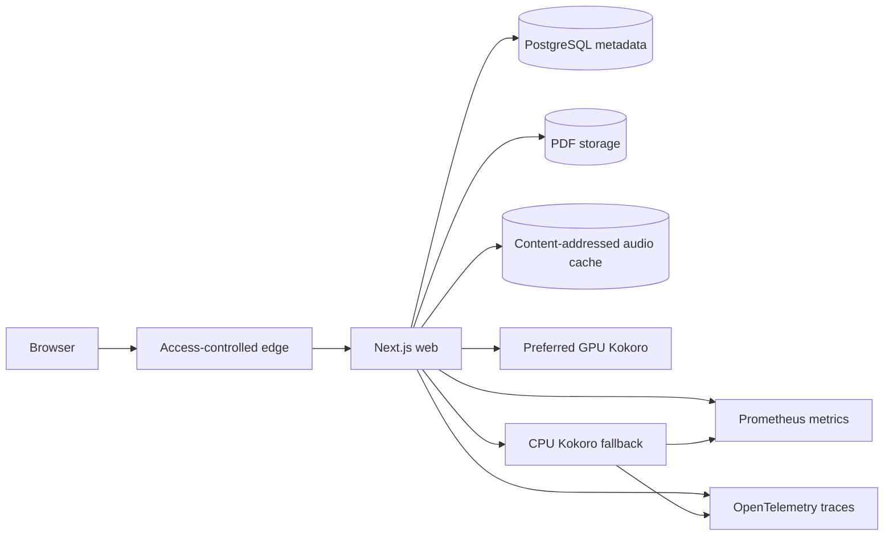

# tts.raizhost.com

A self-hosted PDF reader that turns extracted text into speech, remembers reading position, and routes synthesis between a preferred GPU backend and an in-cluster CPU fallback.

> **Evidence boundary:** this repository contains the application, service code, Kubernetes manifests, alerts, dashboard, tests, and runbooks. It does not contain cluster credentials, sealed secrets, DNS/front-door configuration, the GitOps controller configuration, or public uptime history. The domain is access-controlled; its existence is not presented as availability or scale proof.

## Why this project is useful

The interesting part is the operating model around a stateful, latency-sensitive workload:

- a Next.js application owns authentication, PDF metadata, position, caching, and request routing
- CPU and GPU Kokoro services expose the same bounded HTTP contract
- a probe checks both readiness and first synthesis bytes before considering the preferred backend healthy
- three consecutive primary-probe failures open the circuit; a successful probe closes it
- per-request fallback avoids making one failed request the global source of truth
- Prometheus metrics cover HTTP, cache, queue, backend, and browser-experience signals
- Kubernetes resources use non-root containers, read-only root filesystems, dropped capabilities, resource limits, probes, and service-account token opt-out

The state-machine and probe behavior have dependency-light automated tests. No claim is made that those tests substitute for a real cluster failure drill or historical SLO attainment.

## Architecture



The checked-in Kubernetes topology is single-node oriented: uploaded books, cached audio, and model files use `hostPath`; the web pod uses host networking to integrate with host-local services. These are deliberate constraints, not a highly available platform design. See [docs/architecture.md](docs/architecture.md) for the trust boundaries and limitations.

## Repository map

| Path | Purpose |
| --- | --- |
| `apps/web/` | Next.js 15, TypeScript, Better Auth, Drizzle, PDF reader, cache and backend routing |
| `services/kokoro/` | FastAPI + ONNX Runtime CPU synthesis service |
| `services/kokoro-gpu/` | FastAPI + PyTorch/CUDA synthesis service for a private GPU host |
| `deploy/k8s/` | Kustomize resources, ServiceMonitors, OpenTelemetry instrumentation, and Prometheus rules |
| `deploy/grafana/` | Versioned dashboard JSON |
| `deploy/runbooks/` | Operator procedures and an unresolved observability incident record |
| `docs/` | Architecture, decisions, reliability contract, and failure-exercise scope |

## Verification

CI is review-only and receives no deployment credentials. It runs:

- Node unit tests for primary probe and circuit transitions
- TypeScript typechecking, lint, and a production Next.js build
- Python standard-library contract tests for both synthesis services
- Python syntax compilation
- Kustomize rendering
- a mutable-Action reference check

Run the dependency-light checks locally:

```bash
cd apps/web
npm ci
npm test
npm run typecheck

cd ../..
PYTHONDONTWRITEBYTECODE=1 python3 -m unittest discover -s services/kokoro/tests -p 'test_*.py'
PYTHONDONTWRITEBYTECODE=1 python3 -m unittest discover -s services/kokoro-gpu/tests -p 'test_*.py'
```

The full web build needs the synthetic environment shape used in `.github/workflows/ci.yml`. Local application use also needs PostgreSQL and real secrets; start with [apps/web/.env.example](apps/web/.env.example).

## Reliability contract

[docs/reliability.md](docs/reliability.md) distinguishes provisional SLO targets from actual evidence. The repository currently proves state-machine behavior in tests and provides alerting/runbook definitions. It does **not** publish a sustained availability window or a completed live backend-failure drill.

The safe exercise plan is in [docs/exercises/backend-failover.md](docs/exercises/backend-failover.md); the incident response procedure is in [deploy/runbooks/backend-failure.md](deploy/runbooks/backend-failure.md).

## Deployment boundary

GitHub Actions does not build, publish, deploy, or mutate the cluster. Images in the manifests are local development tags with `imagePullPolicy: Never`. A real release process must build immutable images, record digests/SBOMs, update a separate environment-specific configuration through review, and verify rollout health. Those controls are future work, not implied by this tree.

Do not apply these manifests unchanged to another cluster. They assume external secrets, local storage paths, host networking, monitoring CRDs, and OpenTelemetry components that are intentionally not provisioned here.

## Security and privacy

User PDFs, reading history, authentication material, and recovery codes are sensitive. The public repository contains placeholders only. See [SECURITY.md](SECURITY.md) for reporting and scope.

The historical host-discovery notebook and deployment plan were removed from the current tree because they exposed implementation-specific inventory and had drifted from the code. The sanitized decisions that remain relevant are recorded in [docs/decisions.md](docs/decisions.md).

## License

MIT for original project code. Bundled and downloaded third-party material retains its own license; see [THIRD_PARTY_NOTICES.md](THIRD_PARTY_NOTICES.md).
